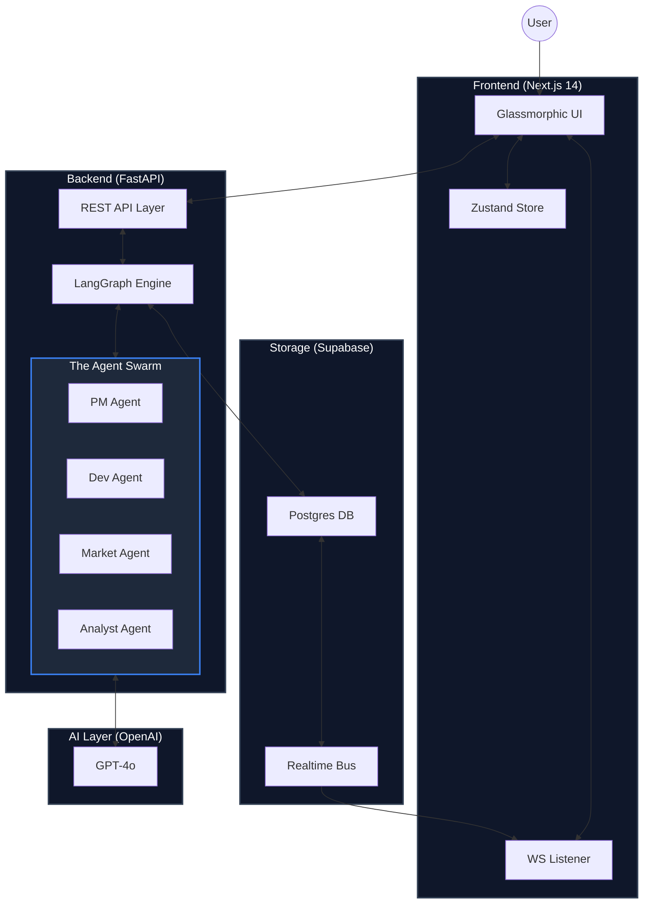
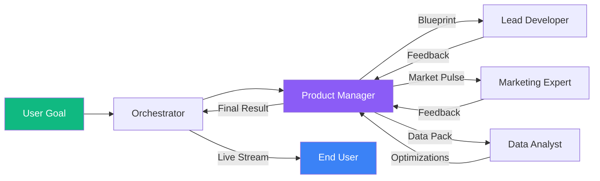

# 🚀 Neural AutoPilot (MeDo)

**The Master Execution & Dashboard Orchestrator (MeDo) — Empowering Autonomous Intelligence.**

Neural AutoPilot (MeDo) is a high-fidelity, autonomous multi-agent platform designed to transform abstract business goals into production-ready execution plans. By utilizing a custom-engineered **Neural Core**, MeDo coordinates a specialized swarm of AI agents to handle every phase of the project lifecycle—from initial strategy to final deployment.

---

## 🏛️ System Architecture: The Neural Core

The MeDo architecture is optimized for high-concurrency and real-time data integrity.

### 1. Holistic Framework Architecture
*Clear, high-level map of the system's structural nodes.*



### 2. The Neural Loop (Execution Sequence)
*Visualizing the step-by-step logic flow between agents.*



---

## 💎 The MeDo Advantage: Why This Matters

MeDo is specifically engineered to solve the "Execution Gap" in modern project management.

| Feature | The MeDo Solution |
| :--- | :--- |
| **Speed** | Description to Roadmap in < 60 seconds |
| **Accuracy** | Cross-agent peer review for every task |
| **Visibility** | Real-time WebSocket stream of AI thinking |
| **Persistence** | Full Supabase sync for every project session |

### 🧠 Autonomous "Self-Healing" Workflows
If a task in the **Active Pipeline** is blocked or requires more info, the agents don't just stop. The **Neural Core** triggers a "Self-Healing" loop where the PM agent attempts to resolve the blocker using information from the other agents, only alerting the user when a high-level decision is required.

---

## 🤖 Deep Dive: The Agent Swarm

Each agent in the MeDo ecosystem is a specialized LLM instance with a dedicated personality and toolset:

- **Master Orchestrator**: The conductor of the swarm. Handles state routing and real-time streaming updates.
- **Product Manager**: The strategist. Breaks down goals into atomic tasks and manages the project roadmap.
- **Lead Developer**: The builder. Designs architectures, generates database schemas, and writes implementation logic.
- **Marketing Expert**: The growth engine. Conducts competitive analysis and drafts go-to-market strategies.
- **Data Analyst**: The truth-teller. Monitors KPIs, ROI, and project progress with mathematical precision.

---

## 🛠️ Technical Stack & Novelty

### The "Agents as Workers" Philosophy
In MeDo, the LLM is not just a text generator; it is the **Engine of a Worker Swarm**. 
- **LangGraph State Management**: Ensures deterministic, structured communication between agents.
- **Supabase Integration**: Provides a rock-solid, real-time persistence layer for every project.
- **Immersive UX**: Built with Next.js 14, Framer Motion, and Tailwind CSS for a premium feel.

---

## 📂 Project Structure

```text
.
├── backend                 # Neural Core Engine (FastAPI)
│   ├── app
│   │   ├── agents          # Domain-specific AI logic (PM, Developer, etc.)
│   │   ├── api             # High-speed REST & WebSocket Dispatchers
│   │   ├── db              # Supabase Client & Dynamic Schema management
│   │   ├── orchestrator    # LangGraph Core (The Brain of MeDo)
│   │   └── utils           # Security & Real-time Event Bus
│   └── main.py             # Server Entry Point
├── frontend                # Neural Interface (Next.js 14)
│   ├── src
│   │   ├── app             # Dashboard, Command Center, Auth
│   │   ├── components      # Glassmorphic UI Components
│   │   ├── lib             # State (Zustand) & API Connectors
│   │   └── styles          # Design Tokens & CSS
│   └── public              # Neural Assets & Logos
└── schema.sql              # Database Source of Truth
```

---

## 🚀 Quick Start & Deployment

1. **DB**: Execute `schema.sql` in Supabase.
2. **Backend**: `uvicorn app.main:app --host 0.0.0.0 --port 8000`
3. **Frontend**: `npm run dev`

---

**Built with ❤️ for the future of Intelligent Workflows.**
