# 🚀 Neural AutoPilot (MeDo)

**The Master Execution & Dashboard Orchestrator (MeDo) — Empowering Autonomous Intelligence.**

Neural AutoPilot (MeDo) is a high-fidelity, autonomous multi-agent platform designed to transform abstract business goals into production-ready execution plans. By utilizing a custom-engineered **Neural Core**, MeDo coordinates a specialized swarm of AI agents to handle every phase of the project lifecycle.

---

## 🏛️ System Architecture & Logic Flow

The MeDo ecosystem is built on a reactive, multi-layered architecture designed for high-speed autonomous orchestration.

### 1. The Sequential "Neural Loop" (Execution Flow)
*This diagram illustrates the step-by-step logic progression between the User and the Agent Swarm.*

```mermaid
sequenceDiagram
    participant User as 👤 User
    participant ORC as 🧠 Master Orchestrator
    participant PM as 📋 Product Manager
    participant DEV as 💻 Lead Developer
    participant MKT as 📢 Marketing Expert
    participant S as 🗄️ Supabase DB

    User->>ORC: "Launch a Coffee Subscription App"
    ORC->>PM: Initialize Neural Planning
    
    rect rgb(30, 41, 59)
        Note right of PM: Agent analyzes goal & creates roadmap
        PM->>S: Persist 10+ Dynamic Tasks
        S-->>User: (Real-time Pipeline Update)
    end

    par PM to Dev & Marketing
        PM->>DEV: Design Architecture & Schema
        PM->>MKT: Conduct Market Research
    end

    DEV->>PM: Technical Spec Ready
    MKT->>PM: Growth Strategy Ready

    rect rgb(30, 41, 59)
        Note over PM,DEV: Swarm Peer-Review & Refinement
    end

    PM->>ORC: Consolidated Project Package
    ORC-->>User: Streaming Neural Response (WS)
```



### 2. Holistic Framework Architecture
*The structural map of the MeDo technical stack and persistent data nodes.*

```mermaid
graph TD
    %% Node Definitions
    User((User))
    
    subgraph Frontend ["Frontend (Next.js 14)"]
        UI["Glassmorphic UI"]
        State["Zustand Store"]
        WS_Client["WS Listener"]
    end

    subgraph Backend ["Backend (FastAPI)"]
        API["REST API Layer"]
        Engine["LangGraph Engine"]
        
        subgraph Swarm ["The Agent Swarm"]
            PM["PM Agent"]
            DEV["Dev Agent"]
            MKT["Market Agent"]
            ANA["Analyst Agent"]
        end
    end

    subgraph Storage ["Storage (Supabase)"]
        DB["Postgres DB"]
        Realtime["Realtime Bus"]
    end

    subgraph AI ["AI Layer (OpenAI)"]
        GPT["GPT-4o"]
    end

    %% Connections
    User --> UI
    UI <--> State
    UI <--> WS_Client
    UI <--> API
    
    API <--> Engine
    Engine <--> Swarm
    Swarm <--> GPT
    
    Engine <--> DB
    DB <--> Realtime
    Realtime --> WS_Client

    %% Styling
    style Frontend fill:#0f172a,stroke:#334155,stroke-width:2px,color:#fff
    style Backend fill:#0f172a,stroke:#334155,stroke-width:2px,color:#fff
    style Storage fill:#0f172a,stroke:#334155,stroke-width:2px,color:#fff
    style Swarm fill:#1e293b,stroke:#3b82f6,stroke-width:2px,color:#fff
    style AI fill:#0f172a,stroke:#334155,stroke-width:2px,color:#fff
```



---

## 💎 The MeDo Advantage: Why This Architecture Matters

MeDo is specifically engineered to solve the "Execution Gap" in modern project management.

| Strategic Pillar | The MeDo Solution |
| :--- | :--- |
| **Instant Onboarding** | Goal to Roadmap transition in under 60 seconds |
| **Peer-Reviewed Logic** | Cross-agent verification ensures technical feasibility |
| **Radical Transparency** | Real-time WebSocket stream of the AI's internal reasoning |
| **Atomic Persistence** | Every message, task, and activity is stored in Supabase |

---

## 🤖 Deep Dive: The Agent Swarm

- **Master Orchestrator**: Conductor of the swarm. Manages state routing and real-time streaming.
- **Product Manager**: Strategist. Breaks down goals into atomic tasks and manages the roadmap.
- **Lead Developer**: Builder. Designs architectures, generates schemas, and writes implementation logic.
- **Marketing Expert**: Growth engine. Conducts competitive analysis and go-to-market strategies.
- **Data Analyst**: Truth-teller. Monitors KPIs, ROI, and project progress with precision.

---

## 📂 Project Structure

```text
.
├── backend                 # Neural Core Engine (FastAPI)
│   ├── app
│   │   ├── agents          # Domain-specific AI logic (PM, Developer, etc.)
│   │   ├── api             # High-speed REST & WebSocket Dispatchers
│   │   ├── db              # Supabase Client & Dynamic Schema management
│   │   ├── orchestrator    # LangGraph Core (The Brain of MeDo)
│   │   └── utils           # Security & Real-time Event Bus
│   └── main.py             # Server Entry Point
├── frontend                # Neural Interface (Next.js 14)
│   ├── src
│   │   ├── app             # Dashboard, Command Center, Auth
│   │   ├── components      # Glassmorphic UI Components
│   │   ├── lib             # State (Zustand) & API Connectors
│   │   └── styles          # Design Tokens & CSS
│   └── public              # Neural Assets & Logos
└── schema.sql              # Database Source of Truth
```

---

## 🚀 Quick Start

1. **DB**: Execute `schema.sql` in Supabase.
2. **Backend**: `uvicorn app.main:app --host 0.0.0.0 --port 8000`
3. **Frontend**: `npm run dev`

---

**Built with ❤️ for the future of Intelligent Workflows.**
