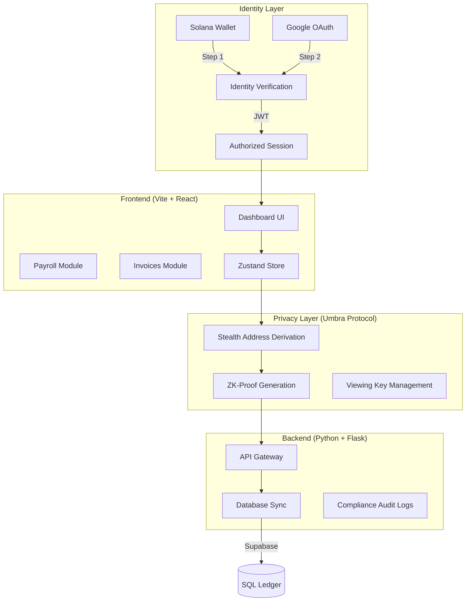

# StealthPay: Private Business Finance OS

StealthPay is a production-grade financial operating system designed for businesses that require absolute privacy on the Solana blockchain. By integrating the **Umbra Protocol SDK**, StealthPay ensures that sensitive financial activities—such as payroll, invoicing, and vendor payments—are completely confidential by default, while remaining legally compliant through selective disclosure.

---

## 🏗️ System Architecture

StealthPay utilizes a high-performance full-stack architecture with a specialized privacy layer.

---

## 🌟 Core Concepts

### 1. Privacy-as-a-Service (PaaS)
On a public ledger like Solana, every transaction is visible. StealthPay solves this by using **Stealth Addresses**. For every payment, a unique, one-time address is derived from the recipient's public key. Only the recipient (and authorized auditors) can link this address back to their main identity.

### 2. Multi-Factor Identity (MFI)
Unlike traditional web3 apps that only use a wallet, StealthPay mandates a **Two-Step Authentication** flow:
- **Cryptographic Identity**: Verified via Solana Wallet signature.
- **Organizational Identity**: Verified via Google Workspace OAuth.
This ensures that corporate financial tools are only accessible to authorized personnel.

### 3. Selective Disclosure (Compliance)
StealthPay balances privacy with regulatory requirements. Every transaction generates a **Viewing Key**. This key allows the holder to decrypt and view transaction details without exposing the user's entire history or private keys.

---

## 🛠️ Implementation Structure

### **Frontend (`/frontend`)**
- **`src/lib/umbra.ts`**: The core privacy engine. Handles stealth address derivation and encryption using the Umbra SDK.
- **`src/store/index.ts`**: Global state management (Zustand) with persistence for sessions and decrypted ledger views.
- **`src/pages/AuthPage.tsx`**: Implements the 2-step premium authentication flow.
- **`src/components/layout/Sidebar.tsx`**: Dynamic navigation with Google identity synchronization.

### **Backend (`/backend`)**
- **`app.py`**: Flask server handling API requests, wallet authentication, and secure database operations.
- **`database/`**: SQL schemas for managing employees, invoices, and payment metadata.

---

## 🚀 How It Works: The Full Lifecycle

1.  **Authentication**: User connects Phantom/Solflare and signs in with Google. The system links the `WalletAddress` to a `GoogleUID`.
2.  **Stealth Setup**: When a business prepares payroll, StealthPay calls the Umbra SDK to derive stealth addresses for each employee based on their public keys.
3.  **Confidential Transfer**: Funds are sent to these one-time addresses. On-chain observers see tokens moving, but cannot identify the source or destination as belonging to the business.
4.  **Claiming**: Recipients use their private keys to "scan" the ledger for transactions destined for their derived stealth addresses and claim them into their main wallet.
5.  **Compliance Audit**: If an auditor requires proof of payment, the user provides the **Viewing Key** for that specific transaction, which the Auditor can use in the **Compliance Terminal** to verify the details.

---

## 📡 Mainnet Configuration

The application is currently configured for **Solana Mainnet-Beta**.

- **Network**: `mainnet-beta`
- **RPC Endpoint**: `https://api.mainnet-beta.solana.com`
- **Encryption Standard**: AES-256 + Umbra v4 Stealth Derivation
- **Protocol**: Umbra Privacy Protocol

---

## 🛠️ Tech Stack

- **UI**: React 18, Tailwind CSS, Framer Motion (Animations), Lucide Icons.
- **Web3**: @solana/web3.js, @umbra-privacy/sdk.
- **Auth**: Firebase (Google OAuth), Solana Wallet Standard.
- **State**: Zustand (with Persist middleware).
- **Backend**: Flask (Python), Supabase (PostgreSQL).

---

© 2026 StealthPay - Private Business Finance OS
