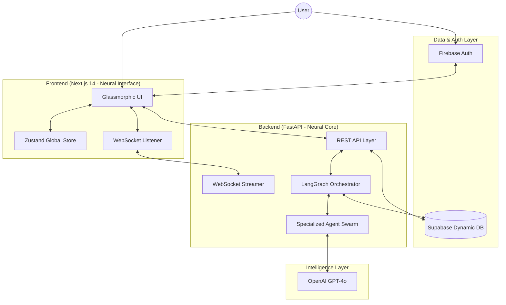
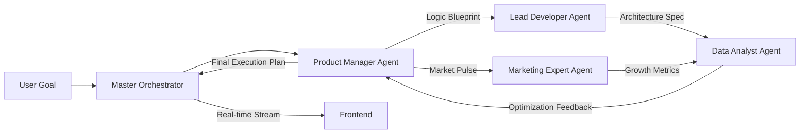

# 🚀 Neural AutoPilot (MeDo)

**The Next Generation of Autonomous Project Execution & Orchestration.**

Neural AutoPilot (MeDo) is a high-fidelity, autonomous multi-agent platform designed to transform complex business goals into production-ready execution plans. Powered by a custom **Neural Core** orchestration engine, it coordinates a specialized swarm of AI agents to handle product management, technical architecture, marketing strategy, and data analysis in a unified, self-healing workflow.

---

## 🏛️ System Architecture

Neural AutoPilot is built on a distributed reactive architecture, ensuring real-time synchronization between the autonomous backend engine and the immersive frontend interface.

### 1. High-Level Architecture


### 2. Autonomous Agent Workflow (LangGraph Swarm)
The "Neural Core" utilizes a directed acyclic graph (DAG) via **LangGraph** to coordinate inter-agent communication and state management.



---

## ✨ Novelty & Key Features

### 🧠 The "Neural Core" Engine
Unlike standard chatbots, Neural AutoPilot uses a **Stateful Multi-Agent Swarm**. Each agent (PM, Dev, Marketing, Analyst) has its own memory, toolset, and reasoning logic, yet they collaborate via a shared global state to ensure technical feasibility matches business goals.

### ⚡ Autonomous Task Evolution
As agents "think," they dynamically create, assign, and update tasks in the **Active Pipeline**. If a Developer detects a technical blocker, the Product Manager is automatically notified to adjust the roadmap in real-time.

### 💎 High-Fidelity Neural Interface
- **Glassmorphism Design**: A premium, immersive UI with dynamic mesh gradients and neural-pulse animations.
- **Real-time Swarm Monitoring**: Watch the thinking process of each agent via streaming WebSocket events.
- **Interactive Workflow Graphs**: Visualize the logic tree generated by the agents using React Flow.

---

## 📂 Project Structure

```text
.
├── backend                 # Neural Core (FastAPI)
│   ├── app
│   │   ├── agents          # specialized agent logic (PM, Dev, etc.)
│   │   ├── api             # REST & WebSocket endpoints
│   │   ├── db              # Supabase client & schema
│   │   ├── models          # Pydantic schemas & state contracts
│   │   ├── orchestrator    # LangGraph engine & swarm logic
│   │   └── utils           # Auth & Event bus utilities
│   └── main.py             # Entry point
├── frontend                # Neural Interface (Next.js 14)
│   ├── src
│   │   ├── app             # App router (Dashboard, Chat, Auth)
│   │   ├── components      # Glassmorphic UI components
│   │   ├── lib             # State (Zustand), API (Axios), WebSockets
│   │   └── styles          # Design system & Global CSS
│   └── public              # Neural assets & logos
└── schema.sql              # Database blueprint
```

---

## 🛠️ Installation & Setup

### 1. Prerequisites
- Node.js 18+
- Python 3.10+
- Supabase Project (Database)
- Firebase Project (Auth)

### 2. Database Initialization
Execute the `backend/app/db/schema.sql` in your Supabase SQL Editor. This sets up the following tables:
- `conversations`: Primary session storage.
- `messages`: Multi-role chat history.
- `tasks`: Dynamic pipeline jobs.
- `agent_activities`: Swarm logs.
- `workflows`: Visual graph states.

### 3. Backend Setup
```bash
cd backend
python -m venv venv
source venv/bin/activate
pip install -r requirements.txt
# Configure .env with OPENAI_API_KEY, SUPABASE_URL, and SERVICE_ROLE_KEY
uvicorn app.main:app --host 0.0.0.0 --port 8000
```

### 4. Frontend Setup
```bash
cd frontend
npm install
# Configure .env.local with NEXT_PUBLIC_FIREBASE and NEXT_PUBLIC_SUPABASE keys
npm run dev
```

---

## 🌟 Real-World Example: "The Global E-Commerce Launch"

**User Input:** *"I want to launch a sustainable clothing brand targeting Gen-Z in Europe."*

1.  **Orchestrator** initializes the swarm.
2.  **Product Manager** generates a 12-month roadmap, creating 15 tasks in the **Active Pipeline**.
3.  **Lead Developer** designs the Shopify/Next.js architecture and generates the database schema.
4.  **Marketing Expert** conducts a competitor audit and drafts an Instagram/TikTok content calendar.
5.  **Data Analyst** projects customer acquisition costs (CAC) and lifetime value (LTV) models.
6.  **User** watches the **Workflow Graph** expand as the agents link these strategies together autonomously.

---

## 📜 License
MeDo Neural Core is proprietary software under the Neural AutoPilot open-contribution license.

**Built with ❤️ for the future of Autonomous Work.**
