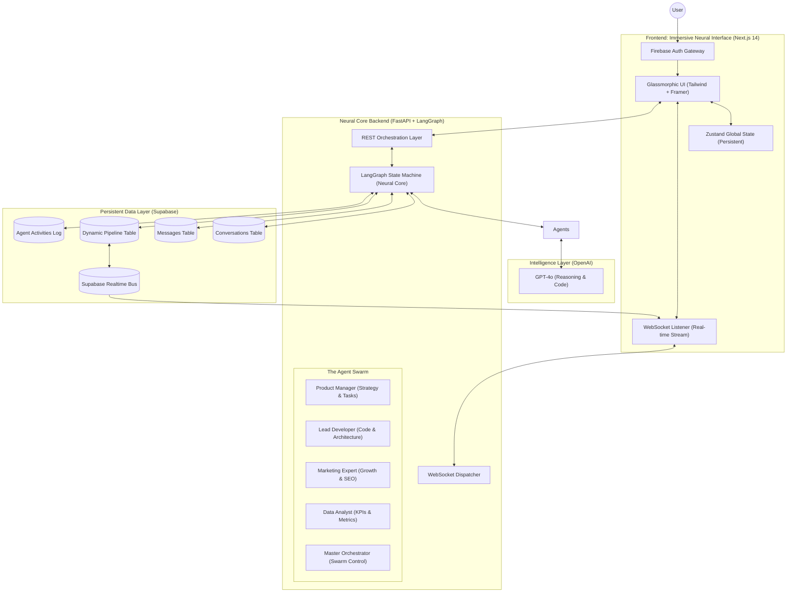
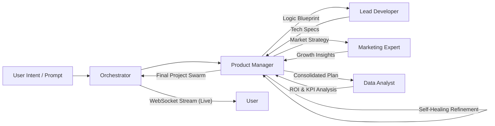

# 🚀 Neural AutoPilot (MeDo)

**The Master Execution & Dashboard Orchestrator (MeDo) — Empowering Autonomous Intelligence.**

Neural AutoPilot (MeDo) is not just a project manager; it is a high-fidelity, autonomous multi-agent platform designed to transform abstract business goals into production-ready execution plans. By utilizing a custom-engineered **Neural Core**, MeDo coordinates a specialized swarm of AI agents to handle every phase of the project lifecycle—from initial strategy to final deployment.

---

## 🏛️ Comprehensive System Architecture

The MeDo architecture is designed for high-concurrency, low-latency, and absolute data integrity. It bridges the gap between complex AI reasoning and a premium, responsive user experience.

### 1. Holistic Neural Interface & Backend Interaction
This diagram illustrates the flow from user intent to autonomous execution and real-time visualization.



### 2. The LangGraph "Neural Loop"
MeDo uses a directed acyclic graph (DAG) to ensure that no agent works in isolation. Every output is peer-reviewed by the swarm before being presented to the user.



---

## 💡 The MeDo Strategic Advantage: Why This Matters

Neural AutoPilot (MeDo) is specifically engineered to solve the "Execution Gap" in modern project management. Here is why this architecture is a game-changer for your workflow:

### 1. Zero-Latency Execution
Standard project management requires manual input at every stage. MeDo eliminates this. When you describe a goal, the **Product Manager** immediately generates a roadmap, which the **Lead Developer** instantly translates into technical tasks. This creates a "Zero-Latency" bridge between vision and reality.

### 2. Cross-Domain Intelligence Swarm
Most AI tools are generalists. MeDo is a **Specialist Swarm**. 
- The **Developer** won't just give you code; they coordinate with the **Marketing Expert** to ensure the code is SEO-optimized and growth-ready.
- The **Data Analyst** monitors the **Task Pipeline** to provide real-time probability of success and ROI projections.

### 3. Autonomous "Self-Healing" Workflows
If a task in the **Active Pipeline** is blocked or requires more info, the agents don't just stop. The **Neural Core** triggers a "Self-Healing" loop where the PM agent attempts to resolve the blocker using information from the other agents, only alerting the user when a high-level decision is required.

### 4. Real-time Insight Transparency
Through the **Command Hub**, you get 100% transparency into the AI's "thought process." The WebSocket stream provides a direct line into the agent's internal reasoning, making the AI's actions predictable, verifiable, and trustworthy.

---

## 🚀 Key Features

- **Dynamic Pipeline Engine**: Tasks are generated and updated live as agents work.
- **Visual Graph Insights**: Real-time visualization of the project's logic tree using React Flow.
- **Glassmorphic Immersion**: A premium, dark-mode-first UI designed for maximum focus and elite aesthetics.
- **Multi-Modal Persistence**: Full synchronization between Firebase (Auth), Supabase (Data), and Zustand (State).

---

## 📂 Project Structure

```text
.
├── backend                 # Neural Core Engine (FastAPI)
│   ├── app
│   │   ├── agents          # PM, Developer, Marketing, Analyst Logic
│   │   ├── api             # High-speed REST & WebSocket Endpoints
│   │   ├── db              # Supabase Client & Schema Management
│   │   ├── models          # State Contracts & Data Schemas
│   │   ├── orchestrator    # LangGraph Engine (The Brain)
│   │   └── utils           # Auth, Security & Event Bus
│   └── main.py             # Server Entry Point
├── frontend                # Neural Interface (Next.js 14)
│   ├── src
│   │   ├── app             # App Router (Dashboard, ChatHub, Auth)
│   │   ├── components      # Glassmorphic UI & Active Components
│   │   ├── lib             # State (Zustand), API (Axios), WS Clients
│   │   └── styles          # Premium Design System (Vanilla CSS)
│   └── public              # Neural Assets & Logos
└── schema.sql              # Database Source of Truth
```

---

## 🛠️ Getting Started

### 1. Database Setup
Execute `backend/app/db/schema.sql` in your Supabase SQL Editor.

### 2. Backend Boot
```bash
cd backend
python -m venv venv && source venv/bin/activate
pip install -r requirements.txt
uvicorn app.main:app --host 0.0.0.0 --port 8000
```

### 3. Frontend Boot
```bash
cd frontend
npm install && npm run dev
```

---

**Built by ❤️ for the future of Intelligent Workflows.**
