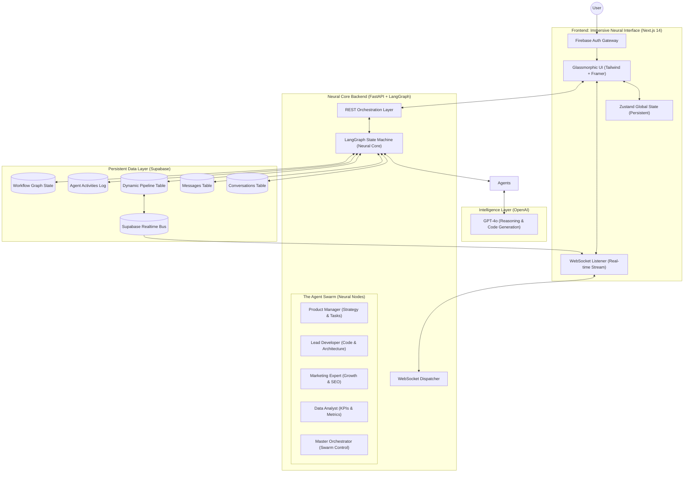
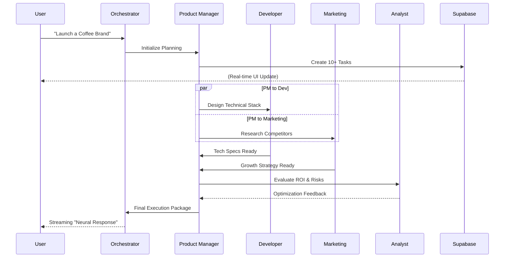

# 🚀 Neural AutoPilot (MeDo)

**The Master Execution & Dashboard Orchestrator (MeDo) — Empowering Autonomous Intelligence.**

Neural AutoPilot (MeDo) is a high-fidelity, autonomous multi-agent platform designed to transform abstract business goals into production-ready execution plans. By utilizing a custom-engineered **Neural Core**, MeDo coordinates a specialized swarm of AI agents to handle every phase of the project lifecycle—from initial strategy to final deployment.

---

## 🏛️ Holistic System Architecture

The MeDo architecture is designed for high-concurrency, low-latency, and absolute data integrity. It bridges the gap between complex AI reasoning and a premium, responsive user experience.

### 1. High-Level Technical Stack & Interaction
This diagram illustrates the flow from user intent to autonomous execution and real-time visualization.



### 2. The LangGraph "Neural Loop" Flow
MeDo uses a directed acyclic graph (DAG) to ensure that no agent works in isolation. Every output is peer-reviewed by the swarm before being presented to the user.



---

## 🤖 The Swarm: Agent Responsibilities

| Agent | Core Responsibility | Key Tools & Outputs |
| :--- | :--- | :--- |
| **Master Orchestrator** | Coordinates the entire swarm | WebSocket Streaming, State Routing |
| **Product Manager** | Strategy & Roadmap | Backlog creation, Milestone planning |
| **Lead Developer** | Architecture & Code | Database schemas, Next.js scaffolding |
| **Marketing Expert** | Growth & SEO | Competitor audits, Social media strategy |
| **Data Analyst** | Business Intelligence | KPI models, ROI projections, Progress tracking |

---

## 💡 The MeDo Strategic Advantage: Why This Architecture Matters

Neural AutoPilot (MeDo) is specifically engineered to solve the "Execution Gap" in modern project management.

### 1. Zero-Latency Intent-to-Action
Standard project management requires manual input at every stage. MeDo eliminates this. When you describe a goal, the **Product Manager** immediately generates a roadmap, which the **Lead Developer** instantly translates into technical tasks. This creates a "Zero-Latency" bridge between vision and reality.

### 2. Cross-Domain Intelligence Swarm
Most AI tools are generalists. MeDo is a **Specialist Swarm**. 
- The **Developer** won't just give you code; they coordinate with the **Marketing Expert** to ensure the code is SEO-optimized and growth-ready.
- The **Data Analyst** monitors the **Task Pipeline** to provide real-time probability of success and ROI projections.

### 3. Autonomous "Self-Healing" Workflows
If a task in the **Active Pipeline** is blocked or requires more info, the agents don't just stop. The **Neural Core** triggers a "Self-Healing" loop where the PM agent attempts to resolve the blocker using information from the other agents, only alerting the user when a high-level decision is required.

---

## ✨ Novelty: "Agents as Workers" vs "LLM as a Tool"

In Neural AutoPilot, the LLM is not just a text generator; it is the **Engine of a Worker Swarm**. 
- **Deterministic Routing**: LangGraph ensures that the flow between agents is structured and predictable.
- **Persistent Memory**: Unlike stateless chats, MeDo remembers the "Why" behind every task, ensuring long-term project consistency.
- **Real-time Feedback Loop**: The system doesn't wait for a "final answer." It streams the thinking process, the task creation, and the logic updates as they happen.

---

## 📂 Deep Project Structure

```text
.
├── backend                 # Neural Core Engine (FastAPI)
│   ├── app
│   │   ├── agents          # Domain-specific AI logic (PM, Developer, etc.)
│   │   ├── api             # High-speed REST & WebSocket Dispatchers
│   │   ├── db              # Supabase Client & Dynamic Schema management
│   │   ├── models          # Pydantic State Contracts & Entity Definitions
│   │   ├── orchestrator    # LangGraph Core (The Brain of MeDo)
│   │   └── utils           # JWT Security, Auth & Real-time Event Bus
│   └── main.py             # Uvicorn entry point
├── frontend                # Neural Interface (Next.js 14)
│   ├── src
│   │   ├── app             # App Router (Dashboard, Command Center, Auth)
│   │   ├── components      # High-fidelity UI & Logic-driven components
│   │   ├── lib             # State management (Zustand) & API connectors
│   │   └── styles          # Design Tokens & Immersive Global CSS
│   └── public              # Logos, Neural assets & optimized media
└── schema.sql              # Database Source of Truth (Postgres)
```

---

## 🛠️ Installation & Rapid Deployment

### 1. Database Setup
Execute `backend/app/db/schema.sql` in your Supabase SQL Editor to initialize the persistence layer.

### 2. Neural Core (Backend)
```bash
cd backend
python -m venv venv && source venv/bin/activate
pip install -r requirements.txt
uvicorn app.main:app --host 0.0.0.0 --port 8000
```

### 3. Neural Interface (Frontend)
```bash
cd frontend
npm install && npm run dev
```

---

**Built with ❤️ for the future of Intelligent Project Orchestration.**
