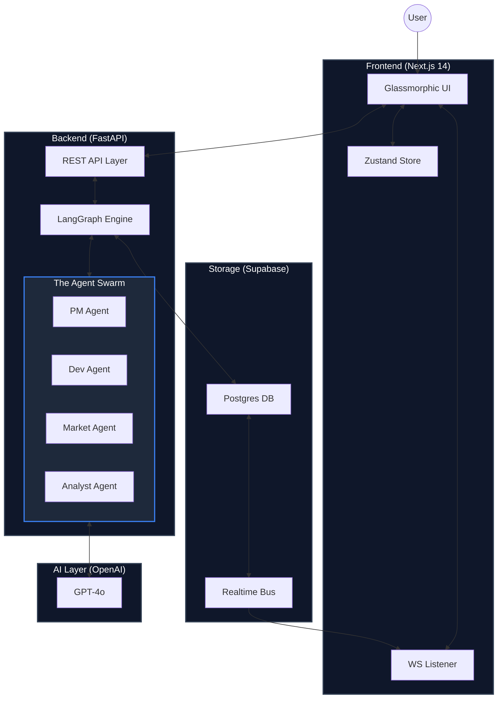

```mermaid
sequenceDiagram
    participant User as 👤 User
    participant ORC as 🧠 Master Orchestrator
    participant PM as 📋 Product Manager
    participant DEV as 💻 Lead Developer
    participant MKT as 📢 Marketing Expert
    participant S as 🗄️ Supabase DB

    User->>ORC: "Launch a Coffee Subscription App"
    ORC->>PM: Initialize Neural Planning
    
    rect rgb(30, 41, 59)
        Note right of PM: Agent analyzes goal & creates roadmap
        PM->>S: Persist 10+ Dynamic Tasks
        S-->>User: (Real-time Pipeline Update)
    end

    par PM to Dev & Marketing
        PM->>DEV: Design Architecture & Schema
        PM->>MKT: Conduct Market Research
    end

    DEV->>PM: Technical Spec Ready
    MKT->>PM: Growth Strategy Ready

    rect rgb(30, 41, 59)
        Note over PM,DEV: Swarm Peer-Review & Refinement
    end

    PM->>ORC: Consolidated Project Package
    ORC-->>User: Streaming Neural Response (WS)
```

# 🚀 Neural AutoPilot (MeDo)

**The Master Execution & Dashboard Orchestrator (MeDo) — Revolutionizing the Future of Autonomous Work.**

Neural AutoPilot (MeDo) is a state-of-the-art, autonomous multi-agent platform designed to bridge the gap between high-level human intent and production-ready project execution. By leveraging a complex **Neural Core** orchestration engine, MeDo coordinates a specialized swarm of AI agents—Product Managers, Developers, Marketing Experts, and Data Analysts—to autonomously build, refine, and optimize your business goals in a unified, self-healing ecosystem.

---

## 🏛️ System Architecture & Framework

The MeDo ecosystem is built on a high-performance, multi-layered architecture designed for extreme transparency and real-time autonomous reasoning.

### 1. Holistic Framework Architecture
*The foundational map of the MeDo technical stack and persistent data nodes.*



### 2. The Sequential "Neural Loop" (Execution Flow)
*Visualizing the step-by-step logic progression between the User and the Agent Swarm.*



---

## 💎 The MeDo Strategic Advantage: Why This Architecture Matters

MeDo is specifically engineered to solve the "Execution Gap" in modern project management.

### 🧠 Autonomous "Self-Healing" Workflows
If a task in the **Active Pipeline** is blocked or requires more info, the agents don't just stop. The **Neural Core** triggers a "Self-Healing" loop where the PM agent attempts to resolve the blocker using information from the other agents, only alerting the user when a high-level decision is required.

### 🌟 Our Vision: The Future of Autonomous Work
At MeDo, we believe that the next era of productivity will be defined by **Human-Swarm Collaboration**. Neural AutoPilot is our first step towards a world where anyone can manifest a complex business idea into a living, breathing project simply by describing it. We are building the operating system for the next generation of builders.

---

## 🤖 Deep Dive: The Agent Swarm

- **Master Orchestrator**: The conductor. Manages state routing, session persistence, and real-time streaming updates.
- **Product Manager**: The strategist. Breaks down goals into atomic tasks and manages the project roadmap.
- **Lead Developer**: The builder. Designs architectures, generates schemas, and writes implementation logic.
- **Marketing Expert**: The growth engine. Conducts competitive audits and drafts go-to-market strategies.
- **Data Analyst**: The truth-teller. Monitors KPIs, ROI, and project progress with mathematical precision.

---

## 🛠️ Technical Stack & Novelty

### The "Agents as Workers" Philosophy
In MeDo, the LLM is not just a text generator; it is the **Engine of a Worker Swarm**. 
- **Deterministic Routing**: LangGraph ensures that the flow between agents is structured and predictable.
- **Real-time Swarm Feedback**: The system streams the thinking process, task creation, and logic updates as they happen.

---

## 📂 Project Structure

```text
.
├── backend                 # Neural Core Engine (FastAPI)
│   ├── app
│   │   ├── agents          # Domain-specific AI logic (PM, Developer, etc.)
│   │   ├── api             # High-speed REST & WebSocket Dispatchers
│   │   ├── db              # Supabase Client & Dynamic Schema management
│   │   ├── orchestrator    # LangGraph Core (The Brain of MeDo)
│   │   └── utils           # Security & Real-time Event Bus
│   └── main.py             # Server Entry Point
├── frontend                # Neural Interface (Next.js 14)
│   ├── src
│   │   ├── app             # Dashboard, Command Center, Auth
│   │   ├── components      # Glassmorphic UI Components
│   │   ├── lib             # State (Zustand) & API Connectors
│   │   └── styles          # Design Tokens & CSS
│   └── public              # Neural Assets & Logos
└── schema.sql              # Database Source of Truth
```

---

## 🚀 Installation & Rapid Deployment

### 1. Database Initialization
- Create a project on [Supabase](https://supabase.com).
- Execute `schema.sql` in the SQL Editor to set up the persistence layer.

### 2. Backend Setup
```bash
cd backend
python -m venv venv && source venv/bin/activate
pip install -r requirements.txt
# Configure .env with OPENAI_API_KEY, SUPABASE_URL, and SERVICE_ROLE_KEY
uvicorn app.main:app --host 0.0.0.0 --port 8000
```

### 3. Frontend Setup
```bash
cd frontend
npm install
# Configure .env.local with NEXT_PUBLIC_SUPABASE and NEXT_PUBLIC_FIREBASE keys
npm run dev
```

---

**Built with ❤️ for the future of Intelligent Project Orchestration.**
